# PAI: Personal AI Infrastructure

> **One founder. Four AI agents. Zero burnout.**
> A fully autonomous e-commerce operations system built in 10 days.

---

## What We Built

PAI is a **Personal AI Infrastructure** that runs an entire e-commerce operation — media buying, customer support, market research, and orchestration — through a fleet of autonomous AI agents. Each agent is a **digital employee** that claims work from a shared GitHub Issues board, executes independently, and closes with evidence.

This isn't a chatbot. It's a workforce.

---

## The Architecture

```mermaid
%%{init: {'theme': 'dark', 'themeVariables': { 'primaryColor': '#4A148C', 'primaryTextColor': '#fff', 'primaryBorderColor': '#6A1B9A', 'lineColor': '#00796B', 'secondaryColor': '#1a1a2e', 'tertiaryColor': '#0d1117', 'background': '#0d1117', 'mainBkg': '#1a1a2e', 'nodeBorder': '#4A148C', 'clusterBkg': '#161b22', 'clusterBorder': '#333', 'titleColor': '#fff', 'edgeLabelBackground': '#1a1a2e'}}}%%
graph TB
    subgraph CMD["🖥️ Command Center — Real-time Dashboard"]
        D1["Next.js 14 + Recharts<br/>Priority-segmented overview<br/>Kanban pipeline • Agent fleet • Metrics"]
    end

    subgraph OC["⚡ OpenClaw — Digital Employee Platform"]
        G1["WebSocket Gateway<br/>Heartbeat engine • Webhook triggers • Multi-agent routing"]
    end

    subgraph AGENTS["🤖 Autonomous Agent Fleet"]
        direction LR
        SEN["📊 <b>Media buyer</b><br/>━━━━━━━━━━<br/>Media Buying<br/><i>ROAS • Spend • Scaling</i>"]
        BVA["📧 <b>VA</b><br/>━━━━━━━━━━<br/>Customer Support<br/><i>Triage • Draft • Resolve</i>"]
        SCT["🔍 <b>Scout</b><br/>━━━━━━━━━━<br/>Market Research<br/><i>VOC • Canvases • Trends</i>"]
    end

    subgraph MAESTRO["🎼 MAESTRO — Orchestrator"]
        direction LR
        AGG["📡 Aggregator<br/><i>Polls every 15s</i>"]
        VER["🛡️ Verification<br/><i>Anti-hallucination</i>"]
        APR["🔒 Approval Gate<br/><i>Shadow mode</i>"]
        LRN["🧠 Learning<br/><i>Tracks decisions</i>"]
    end

    subgraph EXT["🔌 External APIs"]
        direction LR
        META["Meta Ads API"]
        TW["TripleWhale"]
        GMAIL["Gmail API"]
        SHOP["Shopify API"]
        BRAVE["Brave Search"]
    end

    subgraph GH["📋 GitHub Issues — System of Record"]
        G2["Issues → Labels → Claiming → Evidence-based closing"]
    end

    CMD ---- OC
    OC --> SEN & BVA & SCT
    AGG --> SEN & BVA & SCT
    SEN --- META & TW
    BVA --- GMAIL & SHOP
    SCT --- BRAVE
    SEN & BVA & SCT <--> GH
    AGG --> VER --> APR --> LRN
    MAESTRO -.-> |"Telegram"| CMD

    style CMD fill:#1a1a2e,stroke:#4A148C,stroke-width:2px,color:#fff
    style OC fill:#1a1a2e,stroke:#00796B,stroke-width:2px,color:#fff
    style AGENTS fill:#0d1117,stroke:#4A148C,stroke-width:2px,color:#fff
    style MAESTRO fill:#0d1117,stroke:#00796B,stroke-width:2px,color:#fff
    style EXT fill:#161b22,stroke:#333,stroke-width:1px,color:#ccc
    style GH fill:#1a1a2e,stroke:#4A148C,stroke-width:2px,color:#fff
    style SEN fill:#1a1a2e,stroke:#00796B,stroke-width:2px,color:#fff
    style BVA fill:#1a1a2e,stroke:#00796B,stroke-width:2px,color:#fff
    style SCT fill:#1a1a2e,stroke:#00796B,stroke-width:2px,color:#fff
    style AGG fill:#2d1b4e,stroke:#6A1B9A,color:#fff
    style VER fill:#2d1b4e,stroke:#6A1B9A,color:#fff
    style APR fill:#2d1b4e,stroke:#6A1B9A,color:#fff
    style LRN fill:#2d1b4e,stroke:#6A1B9A,color:#fff
```

---

## The Agents

### 📊 Media buyer — Media Buying Autopilot
**Heartbeat: 1 min | Status: LIVE**

| Job Automated | Before | After |
|:---|:---|:---|
| ROAS monitoring | Manual check 3x/day | Continuous with auto-alerts |
| Budget scaling | Manual adjustment | AI recommendations + approval gate |
| Campaign pause | React after damage done | Auto-detect fatigue and frequency spikes |
| Attribution | Switch between dashboards | Unified pipeline, single source of truth |
| Multi-currency | Confusion and errors | Automatic labeling, never mixed |

**Integrations:** Ad platform API (spend, campaigns, ROAS), Attribution API (blended ROAS, profit margin)

> 45min/day of dashboard checking → autonomous. Founder gets a ping only when a decision is needed.

---

### 📧 VA — Customer Support Agent
**Heartbeat: 1 min | Status: LIVE**

| Job Automated | Before | After |
|:---|:---|:---|
| Email triage | Manual inbox scanning | Auto-classify, route, prioritize |
| Native-language responses | Draft manually | VOC-accurate drafts in seconds |
| Order lookup | Log into admin, search | Auto-pull via API |
| Tracking inquiries | Manual lookup | Auto-fetch shipping status |
| Return detection | Read and identify | Pattern matching on native return phrases |
| Thread management | Manual open/close | Auto-close resolved, escalate complex |

**Integrations:** Email API (read/send), E-commerce API (orders, customers), Shipping API

> Emails that took 15-30 min each → drafted in seconds. Approval gate ensures quality.

---

### 🔍 Scout — Market Research Agent
**Heartbeat: 5 min | Status: LIVE**

| Job Automated | Before | After |
|:---|:---|:---|
| Voice of Customer mining | Manual browsing | Automated search + scraping |
| Customer canvas building | Spreadsheets | Structured DB with confidence scores |
| Competitor monitoring | Ad hoc searches | Systematic tracking via issues |
| Content research | Hours of manual work | Delegated via GitHub Issues |

**Integrations:** Web Search API, YouTube metadata extraction

> **Security design:** Scout is the ONLY agent with external research tools. Other agents handle PII and finances — giving them web access would risk prompt injection. Intentional isolation.

---

### 🎼 MAESTRO — The Orchestrator

MAESTRO doesn't do the work — it decides *what* work needs doing and *who* should do it.

```mermaid
%%{init: {'theme': 'dark', 'themeVariables': { 'primaryColor': '#4A148C', 'primaryTextColor': '#fff', 'lineColor': '#00796B', 'secondaryColor': '#1a1a2e', 'background': '#0d1117'}}}%%
graph LR
    subgraph LOOP["MAESTRO Decision Loop"]
        direction LR
        P["📡 Poll<br/><i>Every 15s</i>"] --> V["🛡️ Verify<br/><i>Reality anchors</i>"]
        V --> A["🧠 Analyze<br/><i>Claude-powered</i>"]
        A --> D{"🔒 Dangerous?"}
        D -->|Yes| W["⏳ Wait for<br/>approval"]
        D -->|No| E["⚡ Execute"]
        W -->|Approved| E
        E --> L["📚 Learn<br/><i>Track outcome</i>"]
        L --> P
    end

    style LOOP fill:#0d1117,stroke:#4A148C,stroke-width:2px,color:#fff
    style P fill:#1a1a2e,stroke:#00796B,color:#fff
    style V fill:#1a1a2e,stroke:#00796B,color:#fff
    style A fill:#2d1b4e,stroke:#6A1B9A,color:#fff
    style D fill:#4A148C,stroke:#fff,color:#fff
    style W fill:#1a1a2e,stroke:#ff6b6b,color:#fff
    style E fill:#1a1a2e,stroke:#00796B,color:#fff
    style L fill:#1a1a2e,stroke:#00796B,color:#fff
```

| Capability | How It Works |
|:---|:---|
| **Aggregation** | Polls all agents, builds unified business view |
| **Verification** | Reality anchors, contradiction detection, source attribution |
| **Analysis** | Claude-powered recommendations from verified data only |
| **Triage** | Auto-creates GitHub Issues, assigns to the right agent |
| **Approval Gate** | Blocks dangerous actions until founder explicitly approves |
| **Learning** | Tracks acceptance rate, adjusts recommendations over time |
| **Messaging** | Full bot interface for mobile management |

---

## The Flywheel

> **Why it compounds:** Each customer interaction reveals what people care about. That feedback drives research. Research produces better ad angles. Better ads bring more customers. More customers = more data. **Each revolution of the flywheel makes the next one faster.**

---

## How Work Flows

```mermaid
%%{init: {'theme': 'dark', 'themeVariables': { 'primaryColor': '#4A148C', 'primaryTextColor': '#fff', 'lineColor': '#00796B', 'secondaryColor': '#1a1a2e', 'background': '#0d1117', 'actorTextColor': '#fff', 'actorBkg': '#1a1a2e', 'actorBorder': '#4A148C', 'activationBkgColor': '#2d1b4e', 'activationBorderColor': '#6A1B9A', 'signalColor': '#00796B', 'labelBoxBkgColor': '#1a1a2e', 'labelBoxBorderColor': '#4A148C', 'labelTextColor': '#fff', 'loopTextColor': '#00796B', 'noteBkgColor': '#2d1b4e', 'noteBorderColor': '#4A148C', 'noteTextColor': '#fff', 'sequenceNumberColor': '#fff'}}}%%
sequenceDiagram
    participant M as 🎼 MAESTRO
    participant GH as 📋 GitHub Issues
    participant A as 🤖 Agent
    participant API as 🔌 External API
    participant F as 👤 Founder

    M->>M: Analyze business metrics
    M->>GH: Create issue + assign agent
    Note over GH: auto-labeled with<br/>priority + agent + status

    loop Heartbeat (every 1-5 min)
        A->>GH: Poll for assigned work
        GH-->>A: New issue claimed
        A->>GH: Label → in-progress
        A->>API: Execute task
        API-->>A: Results
        A->>GH: Close with evidence
    end

    GH-->>M: Issue resolved
    M->>F: Notification with summary
    Note over F: Reviews on mobile,<br/>approves if needed
```

---

## What Makes This Different

### Genuinely Autonomous
These aren't scripts on a cron. They're AI agents with:
- **Independent heartbeats** — each agent wakes up, checks for work, claims issues, executes, closes with evidence
- **No human in the loop for ~80%** of operations — monitoring, research, triage all happen autonomously
- **Safety gates** for the ~20% that matters — customer communication, financial actions, spend changes

### Zero External SaaS
No Zapier. No Make.com. No helpdesk software. No marketing automation tool.
- A single VPS
- Open source tools (OpenClaw, Octokit)
- Direct API integrations
- **Monthly cost:** Hosting + API calls. That's it.

### Anti-Hallucination Pipeline
The orchestrator doesn't just generate recommendations — it **verifies them first:**
- **Reality anchors** — every metric traced to its API source
- **Contradiction detection** — flags when agents report conflicting data
- **Source attribution** — any number traceable to the call that produced it
- **Post-processing guard** — catches when the AI claims success on a failed operation

### Production Safety
- **Approval enforcer** — all dangerous actions gated behind explicit approval tokens
- **Circuit breakers** — agent failures don't cascade
- **Firewall** — only essential ports exposed, all services localhost-only
- **Token rotation** — automated credential sync across all agents

---

## System Stats

| Metric | Value |
|:---|:---|
| Autonomous agents | 4 |
| Running services | 7+ |
| Available tools | 16+ |
| Agent heartbeat | 1-5 min |
| Issues processed | 60+ |
| Dangerous actions gated | 100% |
| Time to build | ~10 days |
| Team size | 1 founder + Claude Code |

---

## Future Roadmap

### Phase 1: Creative Agent for Ad Copy
A dedicated agent that closes the loop between research and advertising:

```mermaid
%%{init: {'theme': 'dark', 'themeVariables': { 'primaryColor': '#4A148C', 'primaryTextColor': '#fff', 'lineColor': '#00796B', 'secondaryColor': '#1a1a2e', 'background': '#0d1117'}}}%%
graph LR
    S["🔍 Scout<br/><i>VOC data</i>"] -->|"customer language<br/>+ pain points"| C["🎨 <b>Creative</b><br/><i>Ad copy generation</i><br/><i>Image/video briefs</i><br/><i>Hook library</i>"]
    C -->|"new ad<br/>variants"| SE["📊 Media buyer<br/><i>A/B testing</i>"]
    SE -->|"fatigue signals<br/>+ winner data"| C

    style S fill:#1a1a2e,stroke:#00796B,stroke-width:2px,color:#fff
    style C fill:#4A148C,stroke:#fff,stroke-width:3px,color:#fff
    style SE fill:#1a1a2e,stroke:#00796B,stroke-width:2px,color:#fff

    linkStyle 0 stroke:#00796B,stroke-width:3px
    linkStyle 1 stroke:#00796B,stroke-width:3px
    linkStyle 2 stroke:#ff6b6b,stroke-width:2px,stroke-dasharray:5
```

| Capability | Description |
|:---|:---|
| **Ad copy generation** | VOC data → ad angles → native-language copy |
| **Image/video briefs** | Generate creative briefs from winning angles |
| **A/B test suggestions** | Powered by fatigue signals from Media buyer |
| **Hook library** | Build and maintain proven hooks + angles |
| **Localization** | Native copy that matches real customer voice |

### Phase 2: Proactive Orchestrator
- Morning briefing — overnight summary delivered to mobile
- Opportunity detection — proactive Telegram alerts
- Conversational recall — "What did Scout do today?"

### Phase 3: Presentation Layer
- Evidence digests when agents close issues
- Daily synthesis of all agent activity
- Ask any question about recent operations

### Phase 4: Multi-Store Expansion
The architecture is store-agnostic — everything connects via APIs:
- Spin up a second Media buyer for a new store
- VA handles multiple inboxes
- Scout researches new niches
- MAESTRO orchestrates across all stores

---

## The Stack

| Layer | Technology |
|:---|:---|
| **Runtime** | Node.js (TypeScript), Bun |
| **AI Models** | Claude (Haiku for agents, Sonnet/Opus for analysis) |
| **Agent Platform** | OpenClaw (digital employee framework) |
| **Orchestration** | MAESTRO (custom TypeScript) |
| **System of Record** | GitHub Issues |
| **Dashboard** | Next.js 14 + Tailwind + Recharts |
| **Messaging** | Telegram Bot API |
| **Hosting** | Single VPS, Ubuntu, systemd |
| **Security** | Firewall, localhost-only bindings, approval enforcer, token rotation |
| **APIs** | Ad platform, attribution, email, e-commerce, shipping, web search |

---

*Built with [Claude Code](https://claude.ai/claude-code) + [PAI Algorithm](https://github.com/danielmiessler/PAI) + [OpenClaw](https://github.com/openclaw/openclaw)*
